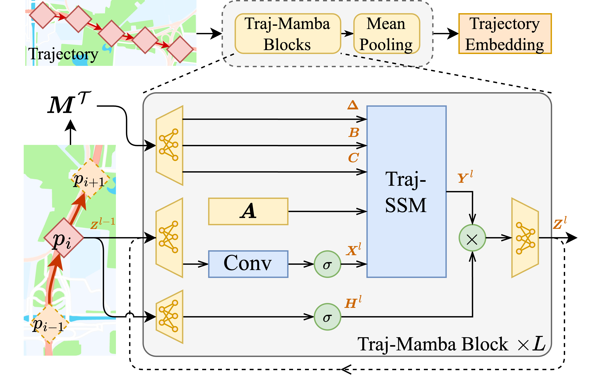
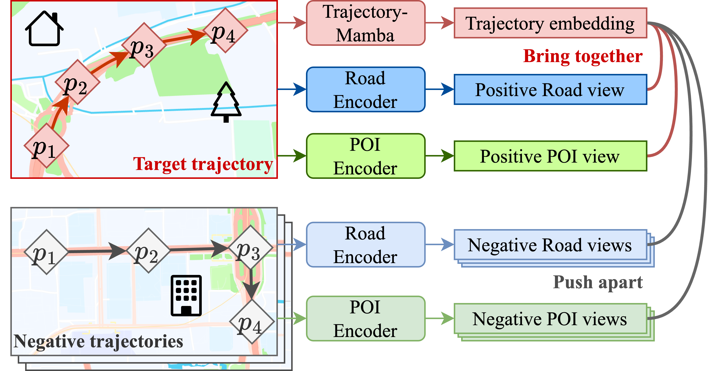

# STMetaT: Spatio-temporal Meta-learning for Trajectory Representation Learning

Implementation code for the Knowledge-Based Systems 2025 paper:
"Spatio-temporal meta-learning for trajectory representation learning".

DOI: https://doi.org/10.1016/j.knosys.2025.114141

This repository contains the model code, experiment settings, figures, and small sample datasets needed for quick local checks. Full Chengdu/Xian datasets, generated search metadata, predictions, and trained checkpoints are intentionally excluded from Git because several files exceed GitHub's normal file-size limits.

## Quick Start

Set OS env parameters:

```bash
export SETTINGS_CACHE_DIR=/dir/to/cache/setting/files;
export MODEL_CACHE_DIR=/dir/to/cache/model/parameters;
export PRED_SAVE_DIR=/dir/to/save/predictions;
export SEARCH_META_DIR=/dir/to/cache/processed_data/search_meta;


```

Run the main script with the sample setting:

```bash
python main.py -s local_test;
```

## Data

The `samples/` directory contains small Chengdu and Xian HDF5/NumPy files for debugging and format reference. For full experiments, place the complete datasets outside Git or under `datasets_from_Lin/`, then update the paths in `settings/*.json` as needed.

## Model Structure



The learnable model of PTrajM, Trajectory-Mamba. It incorporates movement behavior parameterization and a trajectory state-space model (Traj-SSM) to extract continuous movement behavior.



The travel purpose-aware pre-training procedure of PTrajM. It aligns the learned embeddings of Trajectory-Mamba with the travel purpose identified by the road and POI encoders.

## Technical Structure

The parameters and experimental settings are controlled by a JSON configuration file. `settings/local_test.json` provides an example.

The `samples` directory contains subsets of the Chengdu and Xian datasets for reference and quick debugging. The full datasets have the same file format and fields.
