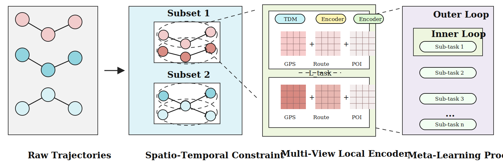

# STMetaT: Spatio-Temporal Meta-Learning for Trajectory Representation Learning

This repository provides the official implementation for the Knowledge-Based Systems 2025 paper "Spatio-temporal meta-learning for trajectory representation learning".

DOI: https://doi.org/10.1016/j.knosys.2025.114141

The repository contains the core model code, experiment settings, architecture figure, and small sample datasets for quick local checks. Full Chengdu/Xian datasets, generated search metadata, predictions, and trained checkpoints are intentionally excluded from Git because several files exceed GitHub's normal file-size limits.

## Quick Start

Set environment variables:

```bash
export SETTINGS_CACHE_DIR=/dir/to/cache/setting/files;
export MODEL_CACHE_DIR=/dir/to/cache/model/parameters;
export PRED_SAVE_DIR=/dir/to/save/predictions;
export SEARCH_META_DIR=/dir/to/cache/processed_data/search_meta;
```

Run the main script with the sample setting:

```bash
python main.py -s local_test;
```

## Data

The `samples/` directory contains small Chengdu and Xian HDF5/NumPy files for debugging and format reference. For full experiments, place the complete datasets outside Git or under `datasets_from_Lin/`, then update the paths in `settings/*.json` as needed.

## Model Structure



STMetaT first constructs spatio-temporal constraint subsets from raw trajectories, then uses a multi-view local encoder to fuse GPS, route, and POI representations. The meta-learning process optimizes these sub-tasks through inner-loop adaptation and outer-loop updates for spatio-temporal heterogeneity fusion.

## Technical Structure

The parameters and experimental settings are controlled by a JSON configuration file. `settings/local_test.json` provides an example.

The `samples` directory contains subsets of the Chengdu and Xian datasets for reference and quick debugging. The full datasets have the same file format and fields.

## Citation

```bibtex
@article{10.1016/j.knosys.2025.114141,
author = {Xu, Zhouzheng and Wu, Yuxing and Zhou, Hang and Fan, Chaofan and Li, Bingyi and Liu, Kaiyue and Ye, Yaqin and Zhou, Shunping and Li, Shengwen},
title = {Spatio-temporal meta-learning for trajectory representation learning},
year = {2025},
issue_date = {Oct 2025},
publisher = {Elsevier Science Publishers B. V.},
address = {NLD},
volume = {327},
number = {C},
issn = {0950-7051},
url = {https://doi.org/10.1016/j.knosys.2025.114141},
doi = {10.1016/j.knosys.2025.114141},
journal = {Know.-Based Syst.},
month = oct,
numpages = {9},
keywords = {Trajectory representation learning, Meta-learning, Spatial heterogeneity}
}
```
