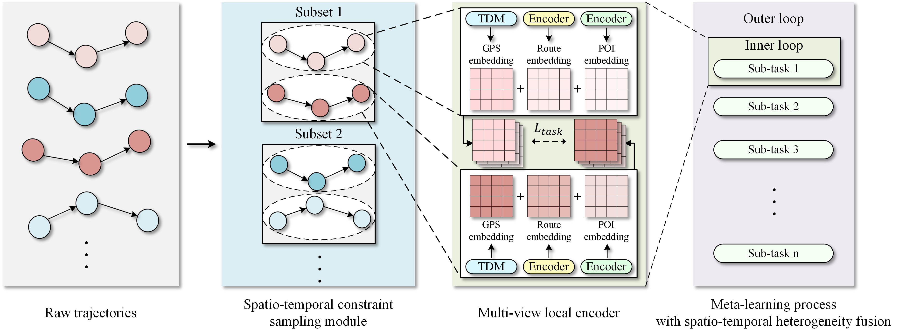

<div align="center">

# STMetaT

## Spatio-Temporal Meta-Learning for Trajectory Representation Learning

**Knowledge-Based Systems, Volume 327, Article 114141 (2025)**

**Zhouzheng Xu** · Yuxing Wu · Hang Zhou · Chaofan Fan · Bingyi Li · Kaiyue Liu · Yaqin Ye · Shunping Zhou · Shengwen Li

<br />

<a href="https://doi.org/10.1016/j.knosys.2025.114141"></a>
<a href="https://www.sciencedirect.com/science/article/pii/S0950705125011827"></a>


</div>

---

> **TL;DR:** STMetaT learns trajectory representations across heterogeneous spatial and temporal contexts. It constructs constrained meta-learning tasks, fuses GPS, road, and POI views, and transfers the resulting representation to destination prediction, travel-time estimation, and similar-trajectory search.



## Highlights

- **Spatio-temporal task construction.** Support/query subsets are sampled under spatial-grid and temporal-window constraints.
- **Multi-view trajectory encoding.** GPS coordinates, road semantics, and POI context are fused instead of relying on a single trajectory view.
- **Meta-learning for heterogeneity.** Inner-loop task adaptation and outer-loop optimization target transfer across distinct spatial and temporal conditions.
- **Multi-task evaluation.** The released pipeline contains prediction and retrieval heads for destination prediction (DP), travel-time estimation (TTE), and similar-trajectory search.

## Method at a Glance

| Stage | Purpose | Code |
|---|---|---|
| **1. Constrained task sampling** | organize trajectories by spatial grid and temporal window | `meta_maml_train.py`, `data.py` |
| **2. Multi-view encoding** | combine geometric, temporal, road, and POI signals | `models/encode.py`, `models/traj_clip.py` |
| **3. Sequence modeling** | model long-range trajectory dependencies | `models/mamba/`, `models/mamba2/` |
| **4. Adaptation and evaluation** | fine-tune task heads and evaluate prediction or retrieval | `pipeline.py`, `models/predictor.py` |

## Repository Scope

| Included | Availability |
|---|---|
| Core model, data pipeline, task heads, and JSON settings | ✅ |
| Small Chengdu/Xian files for schema and local pipeline checks | ✅ |
| Full Chengdu/Xian experimental datasets | not distributed in this repository |
| Trained checkpoints, frozen result tables, and generated search metadata | not distributed in this repository |
| Pinned environment and automated test suite | not yet included |

The files under `samples/` are intended for interface checks, not benchmark reporting.

## Installation

A CUDA-enabled environment is recommended for the Mamba kernels. The code imports the following core packages:

```bash
pip install torch numpy pandas tables scikit-learn einops tqdm higher packaging
pip install mamba-ssm causal-conv1d
```

Package versions are not currently pinned in the repository. Record the exact PyTorch, CUDA, Triton, `mamba-ssm`, and `causal-conv1d` versions used for a formal experiment.

## Data and Configuration

Experiments are driven by `settings/<name>.json`. Each setting identifies:

```text
train_traj_df   HDF5 trajectory table (key: trips)
test_traj_df    HDF5 trajectory table (key: trips)
poi_df          HDF5 POI table (key: pois)
poi_embed       NumPy POI embedding matrix
road_embed      NumPy road embedding matrix
```

`settings/local_test.json` points to the small files under `samples/`. For full experiments, store the datasets outside Git and update the paths in a dedicated settings file.

Optional output locations are controlled through environment variables:

```bash
export SETTINGS_CACHE_DIR=/path/to/settings-cache
export MODEL_CACHE_DIR=/path/to/checkpoints
export PRED_SAVE_DIR=/path/to/predictions
export SEARCH_META_DIR=/path/to/search-metadata
```

## Quick Start

Run the configured pretraining, fine-tuning, and evaluation pipeline:

```bash
python main.py --settings local_test --cuda 0
```

The active stages come directly from the selected JSON file:

- `pretrain`: self-supervised trajectory representation learning;
- `finetune`: downstream adaptation with the configured task head;
- `test`: `dp`, `tte`, or `search` evaluation and optional prediction export.

## Entry Points

| Entry point | Role | Release status |
|---|---|---|
| `main.py` | configuration-driven pretrain → fine-tune → test pipeline | sample configuration included |
| `meta_maml_train.py` | constrained support/query task construction and MAML-style training | research entry point; not cleared for benchmark use until a gradient-flow test passes |

The sample quick start runs `main.py`. Formal STMetaT meta-learning experiments use the dedicated meta-learning entry point and a settings file containing `meta_lr`, `inner_lr`, `num_inner_steps`, `k_shot`, and `q_shot`.

## Outputs

| Path | Content |
|---|---|
| `$SETTINGS_CACHE_DIR/<timestamp>.json` | immutable copy of the selected setting |
| `$MODEL_CACHE_DIR/*.pretrain` | pretrained trajectory encoder |
| `$MODEL_CACHE_DIR/*_trajclip.finetune` | fine-tuned trajectory encoder |
| `$MODEL_CACHE_DIR/*_predhead.finetune` | fine-tuned downstream head |
| `$PRED_SAVE_DIR/<run>/` | optional predictions and targets |
| `$SEARCH_META_DIR/<dataset>/` | generated retrieval candidates and metadata |

## Citation

If STMetaT is useful in your research, please cite:

```bibtex
@article{xu2025stmetat,
  author  = {Xu, Zhouzheng and Wu, Yuxing and Zhou, Hang and Fan, Chaofan and Li, Bingyi and Liu, Kaiyue and Ye, Yaqin and Zhou, Shunping and Li, Shengwen},
  title   = {Spatio-Temporal Meta-Learning for Trajectory Representation Learning},
  journal = {Knowledge-Based Systems},
  volume  = {327},
  pages   = {114141},
  year    = {2025},
  doi     = {10.1016/j.knosys.2025.114141}
}
```

## Third-Party Code and License

The repository contains adapted Mamba/Mamba-2 implementation files. Their upstream sources and license terms should be recorded in a `NOTICE` file before redistribution. A project-level license has not yet been published; please contact the authors before redistributing the code or derived releases.
